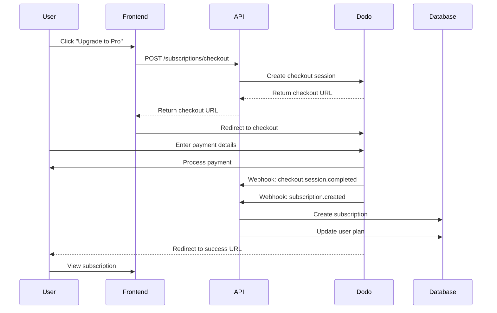
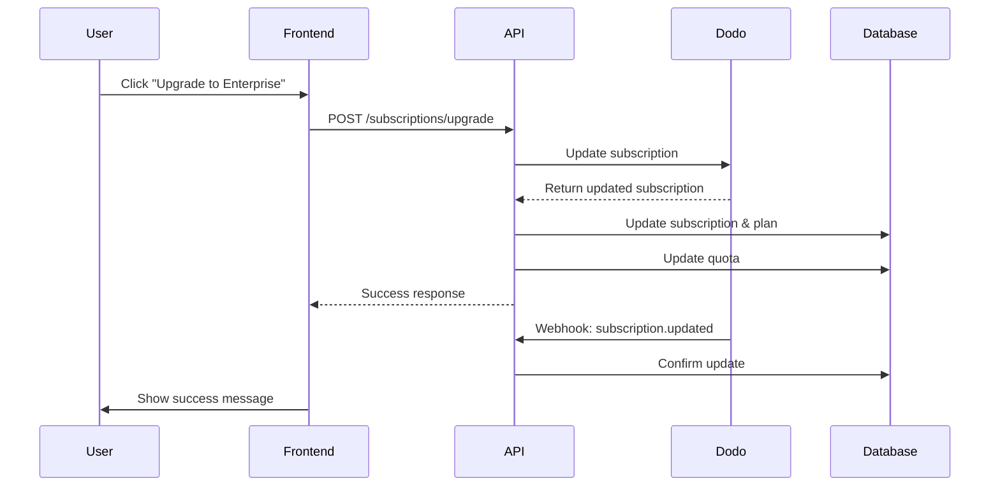
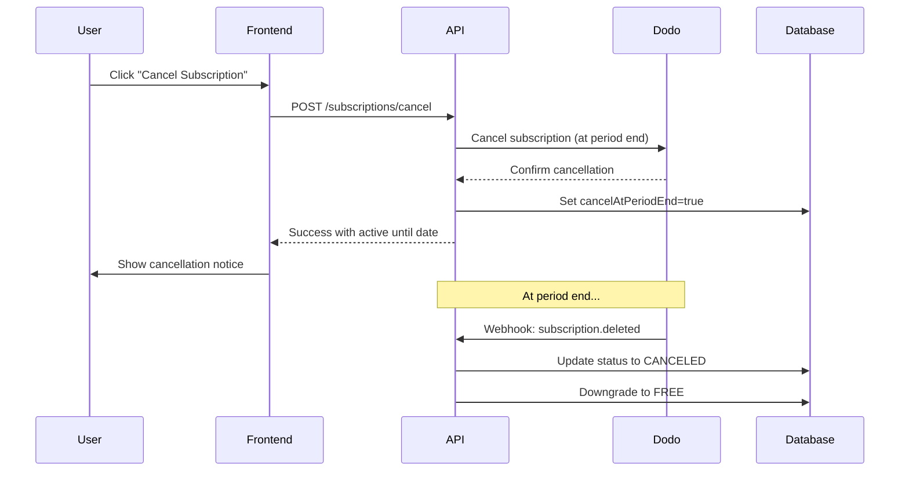

# Subscription & Payment Guide

Complete guide for integrating and managing subscriptions using Dodo Payments.

## Overview

Browser Pool SaaS uses Dodo Payments for subscription management and recurring billing. This guide covers:

- Setting up Dodo Payments
- Subscription lifecycle
- Payment webhooks
- Testing subscriptions
- Common workflows

## Table of Contents

1. [Dodo Payments Setup](#dodo-payments-setup)
2. [Subscription Plans](#subscription-plans)
3. [API Endpoints](#api-endpoints)
4. [Webhook Events](#webhook-events)
5. [Testing](#testing)
6. [Troubleshooting](#troubleshooting)

## Dodo Payments Setup

### 1. Create Dodo Payments Account

1. Sign up at [https://dodo.com](https://dodo.com)
2. Complete account verification
3. Navigate to API Keys section

### 2. Get API Credentials

From your Dodo dashboard:

```bash
# Get your API key
API Keys > Create New Key > Copy Secret Key

# Get your webhook secret
Developers > Webhooks > Add Endpoint > Copy Signing Secret
```

### 3. Create Products and Prices

Create two products in Dodo:

**Pro Plan**
- Product Name: Browser Pool Pro
- Price: $29.00 USD
- Billing: Monthly
- Copy the Price ID (e.g., `price_1A2B3C4D5E6F`)

**Enterprise Plan**
- Product Name: Browser Pool Enterprise
- Price: $299.00 USD
- Billing: Monthly
- Copy the Price ID (e.g., `price_2A2B3C4D5E6F`)

### 4. Configure Environment Variables

Update your `.env` file:

```bash
# Dodo Payments
DODO_API_KEY=sk_live_your_secret_key_here
DODO_API_URL=https://api.dodo.com/v1
DODO_WEBHOOK_SECRET=whsec_your_webhook_secret_here
DODO_PRICE_ID_PRO=price_1A2B3C4D5E6F
DODO_PRICE_ID_ENTERPRISE=price_2A2B3C4D5E6F
```

### 5. Setup Webhook Endpoint

In Dodo Dashboard:

1. Go to Developers > Webhooks
2. Click "Add Endpoint"
3. Enter URL: `https://yourdomain.com/dodo-webhooks`
4. Select events:
   - `checkout.session.completed`
   - `subscription.created`
   - `subscription.updated`
   - `subscription.deleted`
   - `payment.succeeded`
   - `payment.failed`
   - `invoice.paid`
   - `invoice.payment_failed`
5. Save and copy the signing secret

## Subscription Plans

### Free Tier
```json
{
  "name": "Free",
  "price": 0,
  "features": [
    "100 screenshots/month",
    "5 requests/minute",
    "Standard support"
  ]
}
```

### Pro Tier - $29/month
```json
{
  "name": "Pro",
  "price": 29,
  "features": [
    "5,000 screenshots/month",
    "30 requests/minute",
    "Priority support",
    "Webhook notifications"
  ]
}
```

### Enterprise Tier - $299/month
```json
{
  "name": "Enterprise",
  "price": 299,
  "features": [
    "100,000 screenshots/month",
    "100 requests/minute",
    "Dedicated support",
    "SLA guarantee",
    "Custom features"
  ]
}
```

## API Endpoints

### GET /subscriptions/plans

Get available subscription plans.

**Authentication**: Optional

**Response:**
```json
{
  "plans": [
    {
      "id": "FREE",
      "name": "Free",
      "price": 0,
      "currency": "USD",
      "interval": "month",
      "features": [...],
      "quota": 100,
      "rateLimit": 5
    },
    ...
  ]
}
```

### GET /subscriptions

Get user's active subscription.

**Authentication**: Required

**Response:**
```json
{
  "subscription": {
    "id": "uuid",
    "plan": "PRO",
    "status": "ACTIVE",
    "currentPeriodStart": "2024-01-01T00:00:00Z",
    "currentPeriodEnd": "2024-02-01T00:00:00Z",
    "cancelAtPeriodEnd": false
  }
}
```

### POST /subscriptions/checkout

Create a checkout session for a new subscription.

**Authentication**: Required

**Request Body:**
```json
{
  "plan": "PRO",
  "trialDays": 7,
  "successUrl": "https://yourapp.com/success",
  "cancelUrl": "https://yourapp.com/cancel"
}
```

**Response:**
```json
{
  "message": "Checkout session created",
  "checkoutUrl": "https://checkout.dodo.com/session/abc123",
  "sessionId": "cs_abc123"
}
```

**Example:**
```bash
curl -X POST https://api.yourapp.com/subscriptions/checkout \
  -H "X-API-Key: your_api_key" \
  -H "Content-Type: application/json" \
  -d '{
    "plan": "PRO",
    "trialDays": 7
  }'
```

### POST /subscriptions/upgrade

Upgrade or downgrade subscription.

**Authentication**: Required

**Request Body:**
```json
{
  "plan": "ENTERPRISE"
}
```

**Response:**
```json
{
  "message": "Subscription upgraded successfully",
  "subscription": {
    "id": "uuid",
    "plan": "ENTERPRISE",
    "status": "ACTIVE"
  }
}
```

### POST /subscriptions/cancel

Cancel subscription at end of billing period.

**Authentication**: Required

**Response:**
```json
{
  "message": "Subscription will be canceled at the end of the billing period",
  "subscription": {...},
  "activeUntil": "2024-02-01T00:00:00Z"
}
```

### POST /subscriptions/reactivate

Reactivate a canceled subscription.

**Authentication**: Required

**Response:**
```json
{
  "message": "Subscription reactivated successfully",
  "subscription": {...}
}
```

### GET /subscriptions/payments

Get payment history.

**Authentication**: Required

**Response:**
```json
{
  "payments": [
    {
      "id": "uuid",
      "amount": 2900,
      "currency": "USD",
      "status": "SUCCEEDED",
      "plan": "PRO",
      "paidAt": "2024-01-01T00:00:00Z",
      "receiptUrl": "https://dodo.com/receipts/abc123"
    }
  ]
}
```

## Webhook Events

### Event: subscription.created

Triggered when a new subscription is created after successful checkout.

**Payload:**
```json
{
  "id": "evt_123",
  "type": "subscription.created",
  "data": {
    "object": {
      "id": "sub_123",
      "customer_id": "cus_123",
      "plan": "PRO",
      "status": "active",
      "current_period_start": 1704067200,
      "current_period_end": 1706745600
    }
  }
}
```

**Action Taken:**
- Create subscription record in database
- Update user plan
- Create/update user quota
- Trigger internal webhook

### Event: subscription.updated

Triggered when subscription is modified (plan change, status change).

**Action Taken:**
- Update subscription record
- Update user plan if changed
- Adjust quota if plan changed
- Trigger internal webhook

### Event: subscription.deleted

Triggered when subscription ends or is canceled.

**Action Taken:**
- Mark subscription as canceled
- Downgrade user to FREE plan
- Update quota to FREE tier
- Trigger internal webhook

### Event: payment.succeeded

Triggered when a payment is successful.

**Action Taken:**
- Create payment record
- Log successful payment
- Trigger internal webhook

### Event: payment.failed

Triggered when a payment fails.

**Action Taken:**
- Create payment record with failure reason
- Log failed payment
- Trigger internal webhook
- User receives email notification (from Dodo)

### Event: invoice.payment_failed

Triggered when invoice payment fails.

**Action Taken:**
- Update subscription status to PAST_DUE
- Trigger internal webhook
- Limit access if past due

## Testing

### Test Mode

Use Dodo's test mode for development:

```bash
# Use test API keys
DODO_API_KEY=sk_test_your_test_key
DODO_WEBHOOK_SECRET=whsec_test_your_test_secret
```

### Test Cards

Dodo provides test card numbers:

**Success:**
```
Card: 4242 4242 4242 4242
Exp: Any future date
CVC: Any 3 digits
```

**Decline:**
```
Card: 4000 0000 0000 0002
```

**Requires Authentication:**
```
Card: 4000 0025 0000 3155
```

### Testing Webhooks Locally

Use Dodo CLI to forward webhooks to localhost:

```bash
# Install Dodo CLI
npm install -g dodo-cli

# Login
dodo login

# Forward webhooks
dodo listen --forward-to http://localhost:3000/dodo-webhooks
```

### Test Subscription Flow

1. **Create checkout session:**
```bash
curl -X POST http://localhost:3000/subscriptions/checkout \
  -H "X-API-Key: your_test_key" \
  -H "Content-Type: application/json" \
  -d '{"plan": "PRO", "trialDays": 7}'
```

2. **Visit checkout URL** and complete payment with test card

3. **Verify subscription:**
```bash
curl http://localhost:3000/subscriptions \
  -H "X-API-Key: your_test_key"
```

4. **Test upgrade:**
```bash
curl -X POST http://localhost:3000/subscriptions/upgrade \
  -H "X-API-Key: your_test_key" \
  -H "Content-Type: application/json" \
  -d '{"plan": "ENTERPRISE"}'
```

5. **Test cancellation:**
```bash
curl -X POST http://localhost:3000/subscriptions/cancel \
  -H "X-API-Key: your_test_key"
```

## Common Workflows

### Workflow 1: New User Subscription



### Workflow 2: Plan Upgrade



### Workflow 3: Subscription Cancellation



## Troubleshooting

### Issue: Webhook signature verification fails

**Solution:**
1. Verify webhook secret is correct
2. Check that you're sending raw body to verification
3. Ensure timestamp header is present

### Issue: Subscription not created after checkout

**Solution:**
1. Check webhook logs for errors
2. Verify Dodo customer ID is saved
3. Check that plan mapping is correct

### Issue: Payment succeeded but subscription not updated

**Solution:**
1. Check webhook delivery in Dodo dashboard
2. Verify subscription ID matches
3. Check database for subscription record

### Issue: User still on old plan after upgrade

**Solution:**
1. Check subscription.updated webhook was received
2. Verify user.plan was updated in database
3. Check quota was updated

## Security Best Practices

1. **Always verify webhook signatures**
2. **Use HTTPS in production**
3. **Store webhook secret securely**
4. **Log all payment events**
5. **Handle failed payments gracefully**
6. **Don't trust client-side data**
7. **Validate plan transitions**
8. **Implement rate limiting**

## Monitoring

### Key Metrics to Track

- Checkout conversion rate
- Failed payments
- Churn rate
- Plan upgrade/downgrade rates
- Webhook delivery success rate
- Average subscription lifetime

### Logging

All payment events are logged:

```typescript
logger.info('Payment succeeded', {
  userId: user.id,
  paymentId: payment.id,
  amount: payment.amount,
  plan: subscription.plan
})
```

### Alerts

Set up alerts for:
- Failed webhook deliveries
- High payment failure rate
- Subscription cancellations spike
- Webhook signature failures

## Support

For Dodo Payments support:
- Documentation: https://docs.dodo.com
- Support: support@dodo.com
- Status: https://status.dodo.com

For application support:
- API Documentation: `/docs/API.md`
- Email: support@yourapp.com
